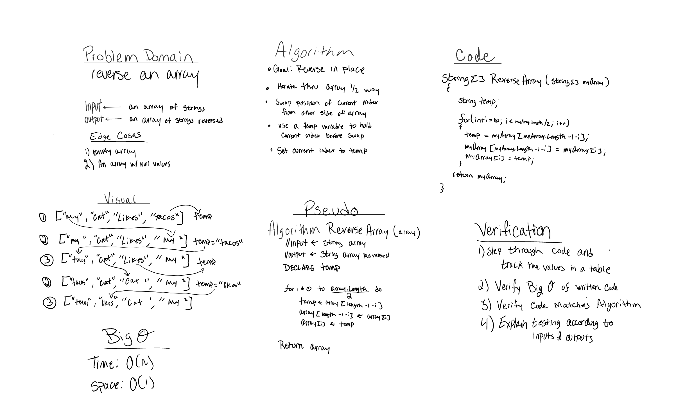

# Reverse an Array

## Challenge
Write a function called reverseArray which takes an array as an argument. Without utilizing any of the built-in methods available 
to your language, return the provided array argument with elements in reversed order.

## Approach & Efficiency

Two approaches were taken for this code challenge:

1. Big O Time = O(n) // Big O Space = O(n)
	- This approach consisted of moving everything from one array to another. This approach takes a little longer 
	and creates more space, but will only run for the length of the array. 

2. Big O Time = O(log n) // Big O Space = O(1)
	- Reversing an array in place is the most efficient approach. 

## Solution

